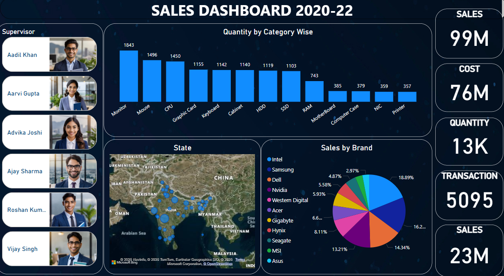

# Sales-Dashboard-
## Overview

This Power BI dashboard provides a comprehensive analysis of sales performance, including revenue, profit, orders, and return rates. It enables data-driven decision-making by visualizing key trends and insights.

## Features

Revenue & Profit Tracking: Monitor total revenue and profit over time.

Order Analysis: View total orders and return rates by product.

Geographical Insights: Analyze sales distribution across different countries.

Product Performance: Identify top-selling products and categories.

Trend Analysis: Track sales growth and seasonal variations.

## Data Sources

Sales transaction data

Order details (product, quantity, revenue, return rate)

Geographical sales distribution

## Tools & Technologies

Visualization Tool: Power BI (or any BI tool used for analysis)

Data Source: CSV, SQL, or any database containing sales data

Programming Languages (if applicable): Python, SQL, or DAX for data processing

## Usage

Open the Power BI file (SALES DASHBOARD.pbix).

Navigate through different visualizations to explore insights.

Use filters to analyze data by region, product category, and time period.

## Dashboard 
&nbsp;
